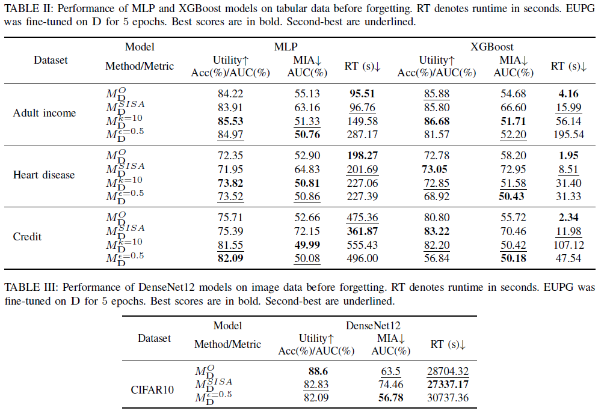
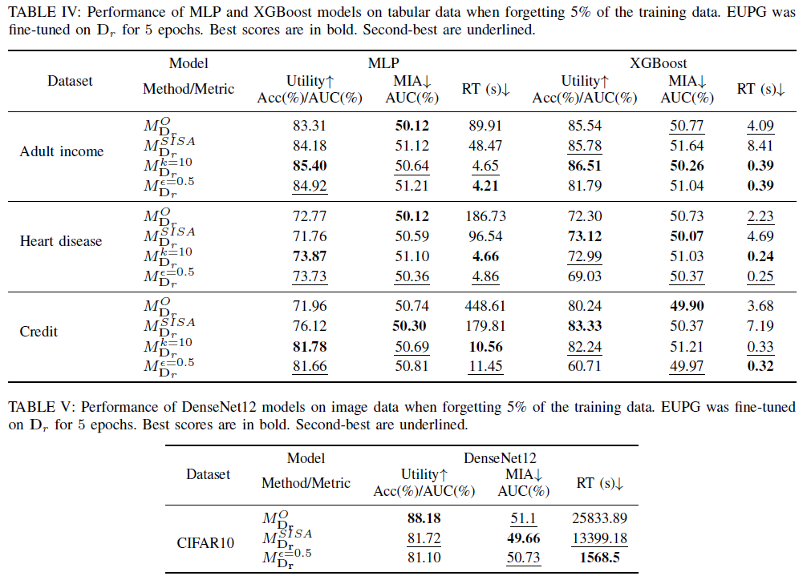

# EUPG: Efficient Unlearning with Privacy Guarantees

This is the official repository containing the code needed to replicate the results from "EUPG: Efficient Unlearning with Privacy Guarantees."

## Paper

[EUPG: Efficient Unlearning with Privacy Guarantees]()

## Usage

The repository includes Python scripts that can be used to reproduce the experiments reported in the paper across different benchmarks and privacy techniques.

### Running Experiments

#### Baseline Experiments

To run baseline experiments (training on full data and retraining on retain set):

```bash
python baseline_experiments.py --dataset adult --model mlp --forget_ratios 0.05 0.1 --n_repeat 3 --max_epochs 100
```


#### Privacy Experiments

To run comprehensive privacy experiments including k-anonymity and differential privacy:

```bash
# Run all experiment types
python privacy_experiments.py --dataset adult --model mlp --experiments baseline kanonymity dp --forget_ratios 0.05 --n_repeat 3 --max_epochs 100 --k_values 10 20 --eps_values 2.5 5.0 --ft_epochs 5 10

# Run only k-anonymity experiments
python privacy_experiments.py --dataset adult --model mlp --experiments kanonymity --k_values 3 5 10 20 80 --ft_epochs 5 10 20

# Run only differential privacy experiments
python privacy_experiments.py --dataset cifar10 --model densenet --experiments dp --eps_values 0.5 2.5 5.0 25.0 50.0 100.0 --ft_epochs 5 10 20
```

### Supported Configurations

**Model-Dataset Combinations:**
- **Tabular datasets** (Adult, Credit, Heart): `mlp`, `xgboost`
- **Image dataset** (CIFAR-10): `densenet`

**Experiment Types:**
- `baseline`: Standard training and retraining experiments
- `kanonymity`: K-anonymity privacy-preserving experiments (tabular data only)
- `dp`: Differential privacy experiments

### Command Line Arguments

**Common Arguments:**
- `--dataset`: Choose from `adult`, `credit`, `heart`, `cifar10`
- `--model`: Choose from `mlp`, `xgboost`, `densenet`
- `--forget_ratios`: List of forget ratios (default: `[0.05]`)
- `--n_repeat`: Number of experimental repetitions (default: `3`)
- `--max_epochs`: Maximum training epochs (default: `100`)

**Privacy-Specific Arguments:**
- `--experiments`: List of experiment types to run
- `--k_values`: K-anonymity values (default: `[10]`)
- `--eps_values`: Differential privacy epsilon values (default: `[2.5]`)
- `--ft_epochs`: Fine-tuning epochs (default: `[5]`)

### Output and Metrics

The scripts provide comprehensive output including:

**Real-time Progress:**
- Individual run results for each experiment
- Phase-by-phase progress tracking
- Detailed timing information

**Metrics Displayed:**
- **Performance**: Training/test accuracy, retain/forget accuracy
- **Privacy**: Membership Inference Attack (MIA) AUC and advantage
- **Efficiency**: Training times, preprocessing times

**Results Storage:**
- CSV files saved in `results/{dataset}/` directory
- Formatted metric tables printed before saving
- Organized by experiment type and parameters

## Datasets

The four datasets used are publicly available (the three tabular datasets are located in the data folder):
- [Adult Income](https://archive.ics.uci.edu/ml/datasets/Adult)
- [Heart Disease](https://www.kaggle.com/sulianova/cardiovascular-disease-dataset)
- [Credit Information](https://www.kaggle.com/c/GiveMeSomeCredit)
- [CIFAR-10](https://www.cs.toronto.edu/~kriz/cifar.html) will automatically be downloaded from Torchvision datasets

### Data Preparation

**Pre-processed raw data** can be downloaded from (https://www.dropbox.com/scl/fi/gqce4cwgawnh8dkn6axgy/data.zip?rlkey=2mmhmnnd8u1fxhkxs0f6bkbxz&st=ri99mqjt&dl=0).

**K-anonymous data** will be generated automatically during training using the built-in MDAV algorithm.

**DP-protected data**: For CIFAR-10 differential privacy experiments, download the folder `dp_data` from (https://www.dropbox.com/scl/fi/j991v1nn6u08heqnyw578/dp_data.zip?rlkey=9c5wup7yohoioq7mvelft1i7q&st=wvnb7wdr&dl=0) to the main directory, then run the scripts inside it to generate DP-protected data with different epsilon values.

## Dependencies

The required Anaconda environment can be installed using the `environment.yml` file:

```bash
conda env create -f environment.yml
conda activate eupg
```

## Experimental Framework

Baside he baseline experiments, the codebase implements a three-phase experimental framework:

1. **Phase 1**: Training on privacy-preserved data (k-anonymous or DP data)
2. **Phase 2**: Fine-tuning on original training data
3. **Phase 3**: Fine-tuning on retain data (for unlearning evaluation)

Each phase evaluates:
- Model performance (accuracy/AUC)
- Privacy leakage (MIA attacks)
- Computational efficiency (timing)

## Main Results

### Before Unlearning

*The tables below show the performance of EUPG before forgetting.*  


### After Unlearning

*The tables below show the post-unlearning performance of EUPG after forgetting 5% of the training data.*  


## File Structure

```
├── baseline_experiments.py     # Core benchmark implementation
├── privacy_experiments.py      # Privacy experiments (k-anonymity, DP)
├── utils.py                   # Utility functions
├── models.py                  # Model definitions
├── train.py                   # Training utilities
├── attacks.py                 # MIA attack implementations
├── mdav.py                    # K-anonymity implementation
├── datasets.py                # Dataset processing utilities
├── data/                      # Raw datasets
├── dp_data/                   # DP-protected data generation
├── results/                   # Experimental results
└── environment.yml            # Conda environment
```

## Citation

*Information to be added*

<!--
## Funding

Partial support for this work has been received from the Government of Catalonia (ICREA Acad\`emia Prizes to J. Domingo-Ferrer and to D. S\'anchez, and grant 2021SGR-00115), MCIN/AEI/ 10.13039/501100011033 and ``ERDF A way of making Europe'' under grant PID2021-123637NB-I00 ``CURLING'', and  the EU's NextGenerationEU/PRTR via INCIBE (project ``HERMES'' and INCIBE-URV cybersecurity chair).
-->


